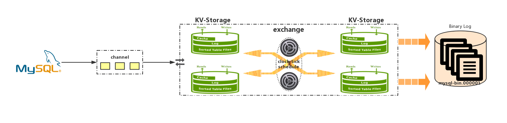

# mysql-binlog 

## Outline     
here including three parts: [backup](./backup/README.md), [merge](./merge/README.md), [recover](./recover/README.md); each part has its own README.md.  

## Illustration  

as three module to show the function mainly arch to dump from MySQL to generate binlog file

### backup 
* [README](./backup/README.md)  
	slave dump binlog from MySQL server and save the binlog event into kv storage which is leveldb, key is the uniq key on table schema infor, and value is unit proto value. 
    

### merge  
* [README](./merge/README.md)  
	merge binlog file to save disk.  

### recover   
* [README](./recover/README.md)  
	dump binlog file from remote and push to mysql using base64 encode binlog statement.  

